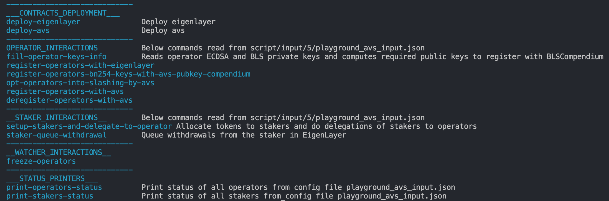

# Eigenlayer AVS playgrounds

This repo contains a barebones AVS setup that can be used as a starting example for AVSs to test their integrations with eigenlayer and learn about our contracts' APIs. The makefile CLI can also be used as a V0

## Installation

```
git clone --recursive git@github.com:Layr-Labs/eigenlayer-AVS-playgrounds.git
```

Make sure to clone with the `--recursive` flag to get the submodules (eigenlayer contracts and forge-test dependencies).

## Eigenlayer contracts

We have deployed a parallel set of contracts on goerli, with all functionality unpaused, for middleware teams to test with. The contract addresses can be found [here](./script/output/5/eigenlayer_deployment_output.json).
The easiest way to start integrating with these contracts is to fork goerli on a local `anvil` chain. You can install anvil using this [guide](https://book.getfoundry.sh/getting-started/installation):

```
anvil --fork-url https://goerli.infura.io/v3/9aa3d95b3bc440fa88ea12eaa4456161
```

If the above URL is not working, choose another one from https://chainlist.org/?testnets=true&search=goerli.

## Deploy the playgroundAVS contracts

In a separate terminal, run

```
export RPC_URL=http://localhost:8545
export PRIVATE_KEY=0xac0974bec39a17e36ba4a6b4d238ff944bacb478cbed5efcae784d7bf4f2ff80
make deploy-avs
```

This deploys the playgroundAVS service manager contract (which you will need to modify to contain your own AVS' slashing logic) as well as a suite of registry contracts (which can most likely be used as-is for most AVSs).

## Makefile starting point

At any point run `make` to get info on the different possible commands.



## Operator and staker interactions

Now feel free to play with any of the other make commands, learn from the errors, ask us questions, etc.

```
make register-operators-with-eigenlayer
```

At any point, to know the status of your operators and stakers, run the STATUS_PRINTERS functions

```
make print-operators-status
make print-stakers-status
```

For a lot more detail and explanation of each command in detail, look at the [runbook](./docs/runbook.md).

## Playbooks

After having deployed all contracts, you can interact with by running the different playbook scripts found in [script/playbooks](./script/playbooks/). These follow the structure outlined in the [AVS-guide](https://github.com/Layr-Labs/eigenlayer-contracts/blob/master/docs/AVS-Guide.md). Also have a look at the [AVS Smart Contracts Template Architecture](https://docs.google.com/document/d/1b_a5Xx5DugM_lWPOdv-vJ3wQnT20IwZ8e8RL6TtlgoM/edit?usp=sharing) doc to understand the registry contracts and how they interact with the service manager and eigenlayer contracts.
