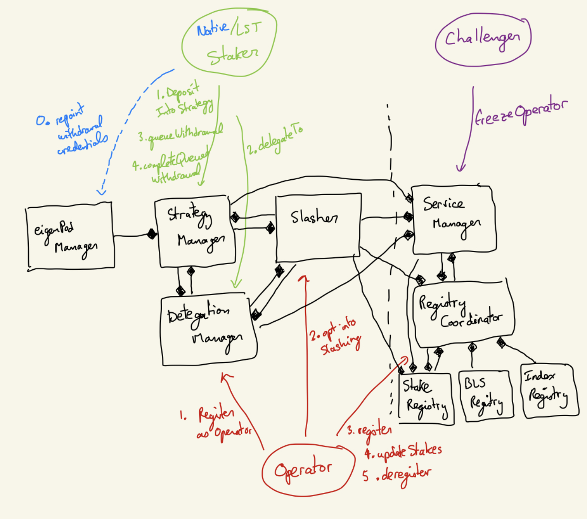

# AVS Runbook - alpha-playground

This is meant as a programmatic follow-along guide to the [AVS Guide](https://github.com/Layr-Labs/eigenlayer-contracts/blob/master/docs/AVS-Guide.md) and the [AVS Smart Contract Architecture](https://docs.google.com/document/d/1EIs9CUaqcPCAYc5UGMRbu6y0BJP7FEY9eja_5lkg0aY/edit). The natgen generated [api docs](https://github.com/Layr-Labs/eigenlayer-contracts/tree/master/docs/docgen/core) for the core contracts will also be helpful, as will the contracts + actors architecture diagram. As a part of the alpha-playground program, our team has deployed a canonical set of contracts representing the EigeLayer protocol on the Goerli Testnet. Our recommendation is that AVS teams use these contracts to conduct any simulations they would like. Below we have added guidance on how to interact with these contracts in a local environment (forked from Goerli) using the Foundry toolkit.



## Makefile commands and their related contract interactions

All of the below commands read from [script/output/5/eigenlayer_deployment_output.json](../script/output/5/eigenlayer_deployment_output.json) and (after deploying the avs contracts) [script/output/5/playground_avs_deployment_output.json](../script/output/5/playground_avs_deployment_output.json). Note that the `5` refers to the chainid, goerli.


### Assumptions made in Playground scripts and json inputs
In this version of playground, we are making the following assumptions:
- There is an 1:1 mapping between stakers and operators. That is, each operator can have only 1 staker delegating their ERC20 token to them.
- There is only one ERC20Mock token is whitelisted in the StrategyManager, so if you need to use another ERC20 token for your AVS (for example if you want to start testing dual or multi quorums), you will need to be added to the alphaMultisig and whitelist that token yourself, or ask us to do it for you. 
- Once the playground has started, the assumption is that if you want to restake any new staker, you can only append its private key to the field `stakerPrivateKeys` in [playground_avs_input.json](https://github.com/Layr-Labs/eigenlayer-AVS-playgrounds/blob/alpha/script/input/5/playground_avs_input.json). Even if a staker has withdrawn from EigenLayer, you shouldn't remove its private key from the array in the field `stakerPrivateKeys`. The indices of stakers that you have to specify in the field `indicesOfStakersToBeWithdrawn` in [withdrawal_request.json](https://github.com/Layr-Labs/eigenlayer-AVS-playgrounds/blob/alpha/script/input/5/withdrawal_request.json) for withdrawing from EigenLayer depends upon the placement of the staker's private key in the field `stakerPrivateKeys` in [playground_avs_input.json](https://github.com/Layr-Labs/eigenlayer-AVS-playgrounds/blob/alpha/script/input/5/playground_avs_input.json).
- Whenever `queueWithdrawalFromEigenLayer` is called, the staker withdraws every shares from every strategy.
- In the example ServiceManager contract [PlaygroundAVSServiceManagerV1](https://github.com/Layr-Labs/eigenlayer-AVS-playgrounds/blob/alpha/src/core/PlaygroundAVSServiceManagerV1.sol), we have set `TASK_DURATION_BLOCKS = 0` and `BLOCK_STALE_MEASURE = 0`. This implies that a staker would be able to complete its withdrawal right after it has notified the AVS.


### Contracts Deployment

#### 0. deploy-eigenlayer

The recommended way of interacting with this avs playground is to fork goerli on a local chain, and deploy the avs contracts on top of the eigenlayer contracts already deployed at the addresses in [script/output/5/eigenlayer_deployment_output.json](../script/output/5/eigenlayer_deployment_output.json). However, we still include this `deploy-eigenlayer` command for completeness. It can be used, for example, to deploy a fresh new set of eigenlayer contracts on an empty local chain instead of forking goerli. That would require setting the alphaMultisig to some EOA address whose private key is known, and using that to whitelist the [ERC20Mock.sol](https://github.com/Layr-Labs/eigenlayer-contracts/blob/40cbfeaefbb3135bbe0bb0f1dfb8ca4cfbb6784b/src/test/mocks/ERC20Mock.sol) contract in the strategy manager. The alphaMultisig on goerli is a proper 1/n gnosis safe, which teams needing to interact with the contracts (for eg., to unfreeze operators) should ask us to be added to.

#### 1. deploy-avs

Deploying the avs contracts deploys the [PlaygroundAVSServiceManagerV1.sol](../src/core/PlaygroundAVSServiceManagerV1.sol) as well as the suite of [registry contracts](https://github.com/Layr-Labs/eigenlayer-contracts/tree/40cbfeaefbb3135bbe0bb0f1dfb8ca4cfbb6784b/src/contracts/middleware), all of which are depicted in the image at the top of this runbook.

### Opting into (aka registering with) Eigenlayer

Before doing anything else, an operator needs to register with Eigenlayer and either deposits funds himself and self-delegate them, or wait for a stake to deposit funds and delegate them to that operator. More detailed information can be found in the [delegation flow](https://github.com/Layr-Labs/eigenlayer-contracts/blob/master/docs/EigenLayer-delegation-flow.md) docs.

#### 1. register-operators-with-eigenlayer

Registering as an operator with eigenlayer effectively enables stakers to delegate their assets to this operator. See [staker-delegate-to-operators](#staker-delegate-to-operators). Note that this does not register the operator with any AVS; it needs to register to each AVS' registry contract separately.

After running this command, you should be able to run [print-operators-status](#print-operators-status) and see the operator's status as opted-in (aka registered):

```
operator is opted in to eigenlayer: true
```

#### 2. staker-mint-tokens
For a staker to be able to participate in EigenLayer, the staker needs to first have tokens from whitelisted ERC20 contracts. This `staker-mint-tokens` function calls the whitelisted [ERC20Mock.sol](https://github.com/Layr-Labs/eigenlayer-AVS-playgrounds/blob/alpha/src/test/mocks/ERC20Mock.sol) to mint some tokens to every staker whose private keys is mentioned in the field `stakerPrivateKeys` in [playground_avs_input.json](https://github.com/Layr-Labs/eigenlayer-AVS-playgrounds/blob/alpha/script/input/5/playground_avs_input.json). 


#### 3. staker-deposit-into-strategies
We have whitelisted a strategy associated with the [ERC20Mock.sol](https://github.com/Layr-Labs/eigenlayer-AVS-playgrounds/blob/alpha/src/test/mocks/ERC20Mock.sol) in the [StrategyManager.sol](https://github.com/Layr-Labs/eigenlayer-contracts/blob/2882f3e07c84c7093c21cc87025da34a771fd5e8/src/contracts/core/StrategyManager.sol). Using `staker-deposit-into-strategies`, all stakers deposit their ERC20 tokens with the whitelisted strategy. 


#### 4. staker-delegate-to-operators
This last step is to simply delegate all of the previously deposited assets to a chosen operator. Given that we have 1:1 matching between stakers and operators, the necessary information on which staker delegate their stake to which operator is obtained from [playground_avs_input.json](https://github.com/Layr-Labs/eigenlayer-AVS-playgrounds/blob/alpha/script/input/5/playground_avs_input.json). Note that one cannot delegate some assets to some operator and other assets to some other operator. Delegation is a binary status to a single operator.


### [Opting into (aka registering with) AVS](https://github.com/Layr-Labs/eigenlayer-contracts/blob/master/docs/AVS-Guide.md#opting-into-avs)

The number of hoops that operators have to jump through to register with a given AVS is directly dependent on the complexity of that AVS' registry contracts. We have written a suite of [registry contracts](https://docs.google.com/document/d/1EIs9CUaqcPCAYc5UGMRbu6y0BJP7FEY9eja_5lkg0aY/edit) which we believe should cover most AVS' needs and not need modification. We recommend keeping to this standard for now (which will also make it easier for us to index your AVS' registry contract, at least until we set a standard for events that need to be emitted from AVS registries), but if simplifications or modifications are needed, please reach out to us.

The current architecture consists of a registryCoordinator, which is the main entrypoint for all calls, which coordinates registration with 3 specific registries:
- StakeRegistry which keeps track of the stakes of different operators for different quorums at different times
- BLSPubkeyRegistry which keeps track of the aggregate public key of different quorums at different times
- IndexRegistry which keeps track of an ordered list of the operators in each quorum at different times. (this is needed for AVS aggregators to loop through the registered operator set at any given block)

This architecture requires one more step over the bare-bone `opt-into-slashing` and `register-with-avs` calls, since the operator also needs to first register his BLS public key (pairing it with his ECDSA address) in the [BLSPublicKeyCompendium.sol](https://github.com/Layr-Labs/eigenlayer-contracts/blob/40cbfeaefbb3135bbe0bb0f1dfb8ca4cfbb6784b/src/contracts/interfaces/IBLSPublicKeyCompendium.sol#L32) contract.


#### 0. fill-operator-keys-info

This command does not appear in the `make` helper printout explicitly because it is called as a subcommand of the [register with the pubkey compendium](#register-operators-bn254-keys-with-avs-pubkey-compendium) command. It runs a [golang binary](../crypto/main.go) whose sole purpose is to generate the BLS public keys and signatures required for the operator to register with the pubkey compendium. It reads the `ECDSAPrivateKey` fields and `BN254PrivateKey` fields from [script/input/5/playground_avs_input.json](../script/input/5/playground_avs_input.json) and generates a struct like the following for each operator:

```json
{
  "ECDSAPrivateKey": "0xdbda1821b80551c9d65939329250298aa3472ba22feea921c0cf5d620ea67b97",
  "BN254PrivateKey": "0x1000",
  "BN254G1PublicKey": {
    "X": "13721099569423026850923337433982403324505725722819852841792898815211399675129",
    "Y": "16601117477696701067583705645824781346940621151880261081973621651314412226347"
  },
  "BN254G2PublicKey": {
    "X0": "21339205082113744844818902120687055060343938081750864912870488932652909233627",
    "Y0": "6261556775110212552820143758409413072248801726733731559359450028314604311538",
    "X1": "16011588866625460476897998592994630228752950831933448067206094363099214699792",
    "Y1": "11231279173142837985516440002115597978607256023911356951476335570928744152072"
  },
  "SchnorrSignatureOfECDSAAddress": "39975156338325939773073583190720765601090517081325092939360921481736180668",
  "SchnorrSignatureR": {
    "X": "18902908738025746854446008638853231217778244343386765018002287715666859394572",
    "Y": "11838852963291902375105792066112039527536049602301322232205681688835368183341"
  }
}
```

The `playground_avs_input.json` file is already filled with these information, but try removing all the fields, adding new private keys (both the ECDSA and BN254 ones are required!), and run this command to observe the file getting filled.

#### 1. register-operators-bn254-keys-with-avs-pubkey-compendium

This will register the operator's BN254 public keys with the [BLSPublicKeyCompendium.sol](https://github.com/Layr-Labs/eigenlayer-contracts/blob/40cbfeaefbb3135bbe0bb0f1dfb8ca4cfbb6784b/src/contracts/middleware/BLSPublicKeyCompendium.sol) compendium, using the information generated from the [fill-operator-keys-info](#fill-operator-keys-info) command. This is a one-time registration, and is required before the operator can register with the playground AVS. Note also that this command will fail if the operator has not registered with eigenlayer first.

#### 2. opt-operators-into-slashing-by-avs

After running this command, you should be able to run [print-operators-status](#print-operators-status) and see the operator's status as opted-in to slashing:

```
operator is opted in to playgroundAVS (aka can be slashed): true
```

#### 3. register-operators-with-avs

TODO(samlaf): add details about registries contracts (should we just link to Gautham's google docs?)

After running this command, you should be able to run [print-operators-status](#print-operators-status) and see the operator's status as REGISTERED into the AVS:

```
operator status in AVS registry: REGISTERED
    operatorId: 0x4b7b8243d970ff1c90a7c775c008baad825893ec6e806dfa5d3663dc093ed17f
    middlewareTimesLen (# of stake updates): 1
    stalestUpdateBlock: 9362065
    latestServeUntilBlock: 0
```

#### 3.5 [deregister-operators-with-avs](https://github.com/Layr-Labs/eigenlayer-contracts/blob/master/docs/AVS-Guide.md#deregistering-from-avs)

Because of the limitations of how we implemented this playground, only a single avs deployment is saved in [/script/output/5/playground_avs_deployment_output.json](../script/output/5/playground_avs_deployment_output.json). Therefore, running the [setup.sh](../setup.sh) script twice in a row will cause issues when the stakers trying to complete their withdrawal, since they need to notify ALL avs' that the operator they are delegated to is opted-in, but the first avs address gets overwritten when running `make deploy-avs` a second time. Hence, one needs to run this `deregister-operators-with-avs` command BEFORE running `make run-all` a second time.

### Staker withdrawal from EigenLayer
This section explains how the scripts can be used for stakers to withdraw from EigenLayer. The file [withdrawal_request.json](https://github.com/Layr-Labs/eigenlayer-AVS-playgrounds/blob/alpha/script/input/5/withdrawal_request.json) specifies the withdrawal requests. The format of this file is:

``` json
{
  "numOfStakersToBeWithdrawn": 3,
  "indicesOfStakersToBeWithdrawn": [
    0,
    2,
    4
  ]
}
```
Here, `indicesOfStakersToBeWithdrawn` is the list of indices of stakers in `stakerPrivateKeys`
in `playground_avs_input.json` file which you want to withdraw from EigenLayer. `numOfStakersToBeWithdrawn` is the number of these stakers that are being withdrawn. Note that they must match otherwise, you will get the error
``` solidity
  "Withdrawal_request.json error: Please ensure numOfStakersToBeWithdrawn is same as the length of indicesOfStakersToBeWithdrawn"
```

All the following functions for enabling staker withdrawals makes use of `recordStakeUpdate` function in [Slasher.sol](https://github.com/Layr-Labs/eigenlayer-contracts/blob/25515edeead416977e6b0bf59b63a74c88f7d9b2/src/contracts/core/Slasher.sol#L167C6-L167C6). More details in [here](https://github.com/Layr-Labs/eigenlayer-contracts/blob/master/docs/AVS-Guide.md#recording-stake-updates).


#### staker-queue-withdrawal
This function is used for enabling stakers to queue their withdrawal request with EigenLayer. This calls on the function `queueWithdrawal` in [strategyManager.sol](https://github.com/Layr-Labs/eigenlayer-contracts/blob/25515edeead416977e6b0bf59b63a74c88f7d9b2/src/contracts/core/StrategyManager.sol#L337) to make this withdrawal request. The information acquired from queueing withdrawal requests are stored in the file [modified_queue_withdrawal_output.json](https://github.com/Layr-Labs/eigenlayer-AVS-playgrounds/blob/alpha/script/output/5/modified_queue_withdrawal_output.json). 


#### staker-notify-service-about-withdrawal
This function would notify the AVS about the intention of all stakers who have queued withdrawal requests by calling `staker-queue-withdrawal`. This will update the record of active queued withdrawal requests with additional information, namely  the fields `isServiceNotifiedYet` and `middlewareTimesIndexForWithdrawal`, in the file [modified_queue_withdrawal_output.json](https://github.com/Layr-Labs/eigenlayer-AVS-playgrounds/blob/alpha/script/output/5/modified_queue_withdrawal_output.json). 

#### advanceChainBy100Blocks
This function advances the Anvil chain by 100 blocks so that when the call to complete queued withdrawals is made, they are successful.

#### staker-complete-queued-withdrawal
This function would complete the queued withdrawal for the staker. In order to do so, the script accesses [modified_queue_withdrawal_output.json](https://github.com/Layr-Labs/eigenlayer-AVS-playgrounds/blob/alpha/script/output/5/modified_queue_withdrawal_output.json) to construct a `QueuedWithdrawal` data structure and `middlewareTimesIndex` for passing as an argument while calling `completeQueuedWithdrawal` in [completeQueuedWithdrawal](https://github.com/Layr-Labs/eigenlayer-contracts/blob/ac143c1b772f3cacad7353024b408e6f168ece69/src/contracts/core/StrategyManager.sol#L450). 


### [Slashing](https://github.com/Layr-Labs/eigenlayer-contracts/blob/master/docs/AVS-Guide.md#slashing)

#### freeze-operators

This call freezes the operator (and the stakers delegated to it). The only way to "unfreeze" an operator is by using the alphaMultisig via the gnosis safe. The [safe](https://app.safe.global/welcome) website does not currently permit sending operator to localchain, so this operation is only possible on goerli itself. After freezing an operator locally, one must then create a new operator, or restart the chain to get that operator active again.

### Status Printers

#### print-operators-status

This prints, for each operator:

```
PRINTING STATUS OF OPERATOR: 0
operator address: 0x23618e81e3f5cdf7f54c3d65f7fbc0abf5b21e8f
dummy token balance: 0
delegated shares in dummyTokenStrat: 0
operator pubkey hash in AVS pubkey compendium (0 if not registered): 0xfa513ae8a064e0fb50959c41249533404c2a7f8090ed79f0a44c85c9c418808c
operator is opted in to eigenlayer: true
operator is opted in to playgroundAVS (aka can be slashed): true
operator status in AVS registry: REGISTERED
    operatorId: 0xfa513ae8a064e0fb50959c41249533404c2a7f8090ed79f0a44c85c9c418808c
    middlewareTimesLen (# of stake updates): 2
    stalestUpdateBlock: 9361912
    latestServeUntilBlock: 9361912
operator is frozen: false
```
An operator initially starts with 0 delegated shares and all the fields set to false. Running through all the above commands sets each of these to true, one by one, until the operator is fully registered into everything contract needed and ready to serve actual AVS tasks.

#### print-stakers-status

This prints, for each staker:

```
PRINTING STATUS OF STAKER: 0
staker address: 0x70997970c51812dc3a010c7d01b50e0d17dc79c8
staker has delegated to some operator: true
staker has delegated to the operator: 0x23618e81e3f5cdf7f54c3d65f7fbc0abf5b21e8f
Balance of stakers in token: (0x0F2961A3ded5806C6eEB3159Fd2f433eDf7e6FeE,0)
Strategies and shares that the staker has deposited into: (0xaaC95d2e9724e52181fF0eFa626088E68B1b356b,200)
```